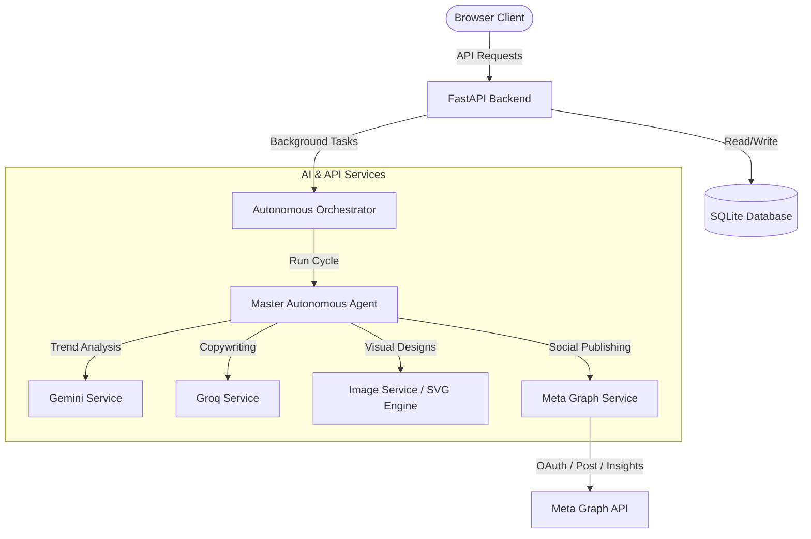

# AI Social Media CRM

AI Social Media CRM is an autonomous content generation, publishing, and client relation management pipeline designed to operate 24/7. Built on FastAPI and vanilla frontend technologies, the platform connects to the Meta Graph API and utilizes LLMs (Gemini, Groq) to automate target-audience research, formulate content strategies, draft copy, generate visual assets, publish directly to social feeds, and retrieve post analytics.

The platform features built-in fallback mock engines, allowing it to run offline or in simulated demo mode without external API connections.

## Key Features

- **Master Autonomous Agent Loop:** Automated background service that coordinates trend scanning, copywriting, graphics generation, and publishing.
- **Meta OAuth Integration:** Full authentication flow to connect Facebook Pages and Instagram Business Accounts.
- **AI Copywriting & Strategy:** Formulates post captions, hooks, CTAs, and optimized hashtags using Groq (Llama 3).
- **AI Trend Research:** Scans page-specific categories to extract relevant industry news using Google Gemini.
- **Dynamic Graphics:** Integrates with the Virtux Image Generation API, falling back to a custom built-in SVG vector rendering engine.
- **Performance Insights:** Retrieves reach and engagement metrics from Meta Insights and logs them to inform future strategies.

## How It Works

The platform operates as a continuous closed-loop pipeline:

```text
Trend Research (Gemini)
  ↳ Strategy Formulation (Scheduling & Format Ratio)
      ↳ AI Copywriting (Groq - Hook, Caption, CTA, Hashtags)
          ↳ Visual Asset Generation (Virtux / SVG Poster Engine)
              ↳ Content Publishing (Meta Graph API)
                  ↳ Analytics Retrieval (Reach & Engagement Rates)
                      ↳ Strategy Feedback Loop (Agent Memory Logs)
```

## Architecture



## Technology Stack

- **Backend:** Python, FastAPI, SQLAlchemy, aiosqlite, APScheduler, HTTPX.
- **Database:** SQLite (local).
- **Frontend:** Vanilla HTML5, CSS3, JavaScript.
- **AI & Integrations:** Groq Cloud APIs (Llama 3), Google Gemini API, Meta Graph API (v19.0), Virtux API.

## Getting Started

### Prerequisites
- Python 3.10+

### Installation & Run
1. **Clone the Repository:**
   ```bash
   git clone https://github.com/JORDAN-JJ4/Ai-social-media-crm.git
   cd Ai-social-media-crm
   ```
2. **Configure Virtual Environment:**
   ```bash
   python -m venv venv
   # Windows:
   .\venv\Scripts\Activate.ps1
   # macOS/Linux:
   source venv/bin/activate
   ```
3. **Install Dependencies:**
   ```bash
   pip install -r requirements.txt
   ```
4. **Setup Environment File:**
   ```bash
   cp .env.example .env
   ```
5. **Run the Application:**
   ```bash
   python run.py
   ```
   *The server will start on `http://localhost:8000` and automatically attempt to open the landing page in your browser.*

## Environment Variables

Configure these in your local `.env` file:

| Variable | Required | Purpose |
| :--- | :--- | :--- |
| `FACEBOOK_APP_ID` | Yes (for live OAuth) | Client App ID from Meta Developer Dashboard |
| `FACEBOOK_CLIENT_SECRET` | Yes (for live OAuth) | Client App Secret from Meta Developer Dashboard |
| `GEMINI_API_KEY` | Yes (for live research) | Google Gemini API credentials |
| `GROQ_API_KEY` | Yes (for live copywriting) | Groq Cloud API credentials |
| `DATABASE_URL` | No | SQLite file path (defaults to `sqlite:///./social_growth.db`) |
| `AUTONOMOUS_CYCLE_INTERVAL_MINUTES` | No | Trigger interval for the orchestrator (default: `60`) |

*If keys are omitted, the application runs in **Mock Simulation Mode** out-of-the-box, simulating all API integrations and using SVG placeholder generation.*

## Project Structure

```text
Ai-social-media-crm/
├── backend/            # Master and supporting AI agents, routers, and services
│   ├── agents/         # AI Orchestration & Master agent
│   ├── routers/        # FastAPI endpoints
│   ├── services/       # Integrations (Gemini, Groq, Meta Graph, Virtux)
│   └── models.py       # DB schemas
├── frontend/           # Vanilla static client assets
└── run.py              # Application runner
```
