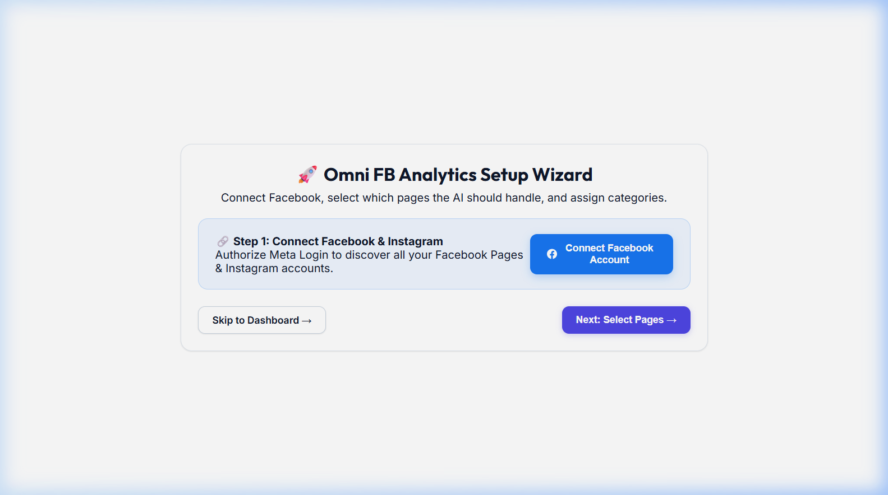
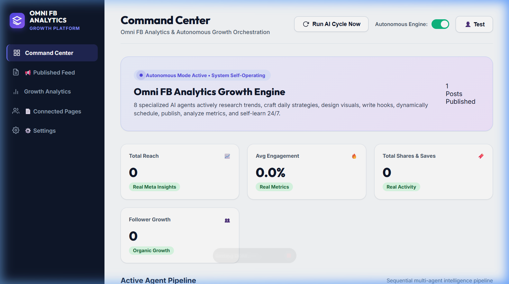
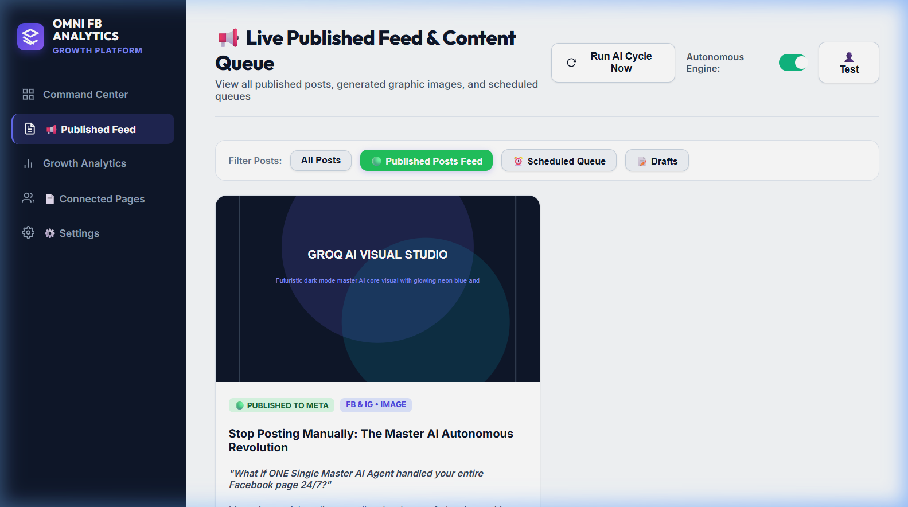
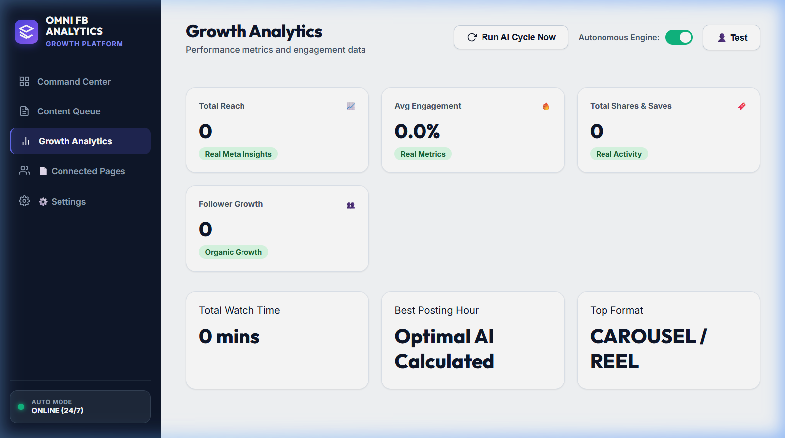
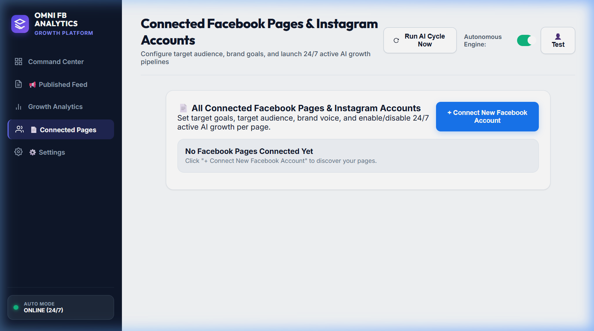

# AI Social Media CRM

AI Social Media CRM is an autonomous content generation, publishing, and client relation management pipeline designed to operate 24/7. Built on FastAPI and vanilla frontend technologies, the platform connects to the Meta Graph API (Facebook and Instagram) and utilizes advanced Large Language Models (LLMs) to perform target-audience research, formulate content strategies, draft copy, generate visual assets, publish directly to social feeds, and retrieve post analytics. The platform features built-in fallback mock engines, allowing it to run offline or in simulated demo mode without external API connections.

## Overview

Managing corporate social media pages requires continuous market research, strategic planning, creative copywriting, visual design, scheduling, and analytics tracking. AI Social Media CRM automates this entire lifecycle by introducing a unified, background-running **Master Autonomous AI Agent**. By defining business goals, tone of voice, and category preferences during onboarding, users launch an automated content loop that keeps their feeds active, analyzes engagement data, and iteratively refines future posts based on historical performance.

## Key Features

* **Master Autonomous Agent Loop:** An automated background service that coordinates trend scanning, copywriting, graphics generation, and page publishing.
* **Meta OAuth Integration:** Full authentication flow to connect Facebook Pages and associated Instagram Business Accounts.
* **Multi-Platform Publishing:** Direct publishing of photo posts to Facebook and Instagram feeds via the Meta Graph API.
* **AI Copywriting & Strategy:** Formulates structured post captions, scroll-stopping hooks, calls-to-action (CTAs), and optimized hashtags using Groq (Llama 3).
* **AI Trend Research:** Periodically scans page-specific categories to extract relevant industry news and viral hooks using Google Gemini.
* **Dynamic Image Poster Engine:** Integrates with the Virtux Image Generation API, falling back to a custom built-in SVG vector rendering engine to generate high-resolution visual assets.
* **Performance Insights:** Retrieves reach and engagement metrics from Meta Insights, logging them into a local database to inform future agent strategies.
* **Interactive Target Goal Customization:** Tailors the agent's tone, custom instructions, and audience segment per connected page.
* **Seamless Local Authentication:** Instant sign-up and auto-registration logic to support multiple local administrators.

## How It Works

The platform operates as a continuous closed-loop pipeline:

```text
Trend Research (Gemini)
  ↳ Strategy Formulation (Scheduling & Format Ratio)
      ↳ AI Copywriting (Groq - Hook, Caption, CTA, Hashtags)
          ↳ Visual Asset Generation (Virtux / SVG Poster Engine)
              ↳ Content Publishing (Meta Graph API)
                  ↳ Analytics Retrieval (Reach & Engagement Rates)
                      ↳ Strategy Feedback Loop (Agent Memory Logs)
```

1. **Trend Research:** The Gemini Service runs periodic market intelligence queries based on the connected page's category.
2. **Strategy:** The Orchestrator determines posting density and balances educational, entertainment, and promotional content.
3. **AI Copywriting:** Groq creates audience-tailored copy matching the brand's tone of voice.
4. **Visual Generation:** Generates graphic design layouts or invokes the fallback SVG vector generator.
5. **Content Publishing:** Publishes content directly to connected Facebook Page and Instagram accounts.
6. **Analytics:** Post metrics are gathered via Meta Insights to gauge performance.
7. **Strategy Feedback:** Metrics are logged to `AgentMemory` to refine upcoming cycles.

## Architecture

The system follows a clean monolithic architecture with modular agent services:


## Technology Stack

* **Backend:** Python, FastAPI, Uvicorn, SQLAlchemy, aiosqlite, APScheduler, HTTPX.
* **Database:** SQLite (local database configuration).
* **Frontend:** Vanilla HTML5, CSS3, JavaScript.
* **AI Models:** Groq Cloud APIs (Llama 3), Google Gemini API (Gemini Flash).
* **Integrations:** Meta Graph API (v19.0), Virtux Image Generation API.

## Application Screens

The application UI is served statically by the backend server across the following main routes:

| Screen | Route | Purpose |
| :--- | :--- | :--- |
| **Landing & Authentication** | `/` | User login, seamless auto-registration, and initial landing page. |
| **Setup & Onboarding Wizard** | `/onboarding` | Interactively guides the user through Facebook OAuth connection, database settings, and API configurations. |
| **Command Center Dashboard** | `/dashboard` | Central monitor displaying active AI agents, suggestions, system logs, and general KPI cards. |
| **Published Feed & Queue** | `/posts` | Chronological feed showing scheduled, draft, published, and failed content items. |
| **Growth Analytics** | `/analytics` | Displays aggregate metrics (reach, impressions, average engagement, followers growth). |
| **Connected Pages** | `/pages` | Configuration portal to manage active page targets, custom instructions, categories, and brand voices. |
| **Global Settings** | `/settings` | Global API credential configuration forms (Gemini/Virtux). |
### Onboarding Wizard


### Dashboard Command Center


### Content Queue & Posts


### Growth Analytics Dashboard


### Connected Pages Configuration


## Local Development

### Prerequisites

* Python 3.10 or higher
* Git

### Installation & Run

Follow these steps to run the application locally on Windows, macOS, or Linux:

1. **Clone the Repository:**
   ```bash
   git clone https://github.com/JORDAN-JJ4/Ai-social-media-crm.git
   cd Ai-social-media-crm
   ```

2. **Configure Virtual Environment:**
   * **Windows (PowerShell):**
     ```powershell
     python -m venv venv
     .\venv\Scripts\Activate.ps1
     ```
   * **macOS / Linux:**
     ```bash
     python3 -m venv venv
     source venv/bin/activate
     ```

3. **Install Dependencies:**
   ```bash
   pip install -r requirements.txt
   ```

4. **Setup Environment File:**
   Copy the example template file to create your local `.env`:
   ```bash
   cp .env.example .env
   ```

5. **Run the Application:**
   ```bash
   python run.py
   ```
   *The server will start on `http://localhost:8000` and automatically attempt to open the landing page in your default browser.*

## Environment Variables

Configure the following variables in your local `.env` file:

| Variable | Required | Purpose |
| :--- | :--- | :--- |
| `APP_NAME` | No | Name display of the platform (Default: `"Omni FB Analytics"`). |
| `DEBUG` | No | Enables debug logging and interactive reload (Default: `True`). |
| `SECRET_KEY` | No | Security signing key for app sessions. |
| `DATABASE_URL` | No | Connection URI. Defaults to local SQLite file: `sqlite:///./social_growth.db`. |
| `FACEBOOK_APP_ID` | Yes (for Meta OAuth) | Client App ID from your Meta Developer Dashboard. |
| `FACEBOOK_CLIENT_SECRET` | Yes (for Meta OAuth) | Client App Secret from your Meta Developer Dashboard. |
| `FACEBOOK_REDIRECT_URI` | Yes (for Meta OAuth) | Auth callback endpoint (Default: `http://localhost:8000/api/auth/facebook/callback`). |
| `GEMINI_API_KEY` | Yes (for Live Research) | Google Gemini API credentials. |
| `GROQ_API_KEY` | Yes (for Live Copywriting) | Groq Cloud API credentials. |
| `AUTONOMOUS_CYCLE_INTERVAL_MINUTES` | No | Orchestrator background loop trigger interval in minutes (Default: `60`). |

## External API Configuration

### Mock Simulation Mode (Default)
If you do not specify credentials for Facebook, Groq, or Gemini, the application operates in **Mock Simulation Mode**. The platform automatically simulates API calls, creates placeholder image banners containing your visual prompts, writes mock copywriting text to your local database, and updates tracking interfaces to mimic live publishing.

### Live Connection Mode
To transition to live operation:
1. **Meta OAuth Setup:** Create a Meta Developer App, configure the "Facebook Login for Business" product, and set the Redirect URI.
2. **Permissions:** Ensure your Meta App is granted `pages_show_list`, `pages_read_engagement`, `pages_manage_posts`, `instagram_basic`, and `instagram_content_publish` permissions.
3. **API Keys:** Add valid Groq, Gemini, and Virtux API keys to your `.env` or input them directly via the onboarding wizard.

## Project Structure

```text
Ai-social-media-crm/
├── .env.example
├── .gitignore
├── requirements.txt
├── run.py
├── vercel.json
├── backend/
│   ├── agents/            # Master and supporting AI agent implementations
│   ├── routers/           # FastAPI routes (auth, setup, posts, analytics, logs)
│   ├── services/          # API integrations (Gemini, Groq, Virtux, Meta Graph)
│   ├── config.py          # Env configuration loader
│   ├── database.py        # SQLAlchemy connections
│   ├── main.py            # FastAPI main entrypoint and lifespan tasks
│   ├── models.py          # SQLAlchemy schemas (User, ConnectedPage, ContentPost)
│   └── schemas.py         # Pydantic validation schemas
└── frontend/              # Vanilla static HTML, CSS and JS assets
```

## Current Status

* **Core Pipeline:** Fully implemented (Trend research, copywriting, dynamic asset generation, and database-backed scheduler).
* **Meta Publishing:** Implemented. Simulates successful publications locally if credentials are absent.
* **API Integrations (Groq, Gemini, Virtux):** Implemented. Falls back to mock values and built-in SVG graphics generator if keys are missing.
* **Onboarding & Configuration:** Fully implemented. Settings are saved directly to the database and synced with the local `.env` file.

## Security Notes

* **Ignore Configuration:** Verify `.env` is kept in `.gitignore` and never committed to version control.
* **Secret Key:** Always customize `SECRET_KEY` in production to secure cookies and sessions.
* **Redirect URIs:** Restrict Meta OAuth redirect URLs to HTTPS in production environments.
* **Deployment:** Transition `DATABASE_URL` to a production PostgreSQL database when deploying to Vercel or cloud hosts.

## Future Improvements

* **Production Database Integration:** Migrate from SQLite to PostgreSQL for multi-tenant deployments.
* **Background Task Worker:** Transition the custom asyncio loop to Celery or Redis Queue (RQ) for industrial stability.
* **Richer Analytics:** Add interactive chart widgets using Chart.js on the analytics screen.
* **Multi-Platform Support:** Expand autonomous publishing to Twitter/X, LinkedIn, and TikTok.

## License

Licensing configurations can be appended to the project at a later stage as required.
